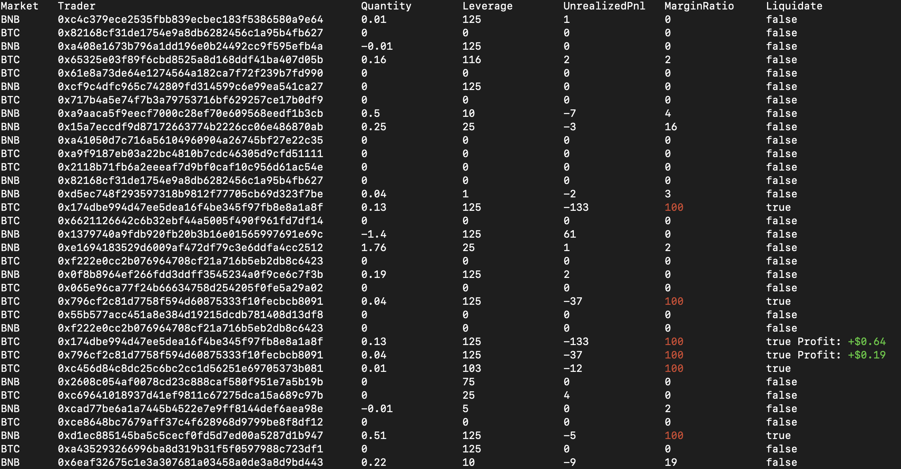

# Position Liquidation Bot
Bot to automatically liquidate undercollateralized [Position Exchange](position.exchange)'s positions



## How It Works?

### Calculating Fee to Liquidator
``If (marginRatio >= PARTIAL_LIQUIDATION_RATIO && marginRatio < 100)``

}{2&space;*&space;100})

``Else`` (FullyLiquidated)

&space;*&space;liquidationFeeRatio}{2&space;*&space;100})

## Installation
Require: ``Nodejs version 16 or later``

```
$ git clone https://github.com/PositionExchangeHolder/position-liquidation-bot.git
$ npm install
$ cp .env.example .env
```

## Quick Start
```bash
$ npm run start
```

## Configurations
| Enviroment Variable | Type | Required | Description | Default |
|:--------------------|:-----|:---------|:------------|:--------|
| PRIVATE_KEY | sender | ``Yes`` | | - |
| POSITION_DERIVATIVE_SUBGRAPH | api | ``Yes`` | | - |
| ENABLE | bot | No | | false |
| MINIMUM_PROFIT_BUSD | bot | No | | 1 |
| CRON_TIME | bot | No | | */5 * * * * |
| DEFAULT_GAS_PRICE | transaction | No | | 5 (Gwei) |
| DEFAULT_GAS_LIMIT | transaction | No | | 400_000 |
| MAINNET_RPC | web3 | No | | https://bsc-dataseed.binance.org/ |
| POSITION_HOUSE_PROXY | address | No | | 0xf495d56a70585c729c822b0a6050c5ccc38d33fa |
| POSITION_HOUSE_VIEWER_PROXY | address | No | | 0x2842AFF5708AFa3E3199Cf508e2DA9Ba8Afcbff3 |
| POSITION_HOUSE_CONFIGURATION_PROXY | address | No | | 0x460f4aab09f2f3802d1a988935589fc1d5f64b14 |
